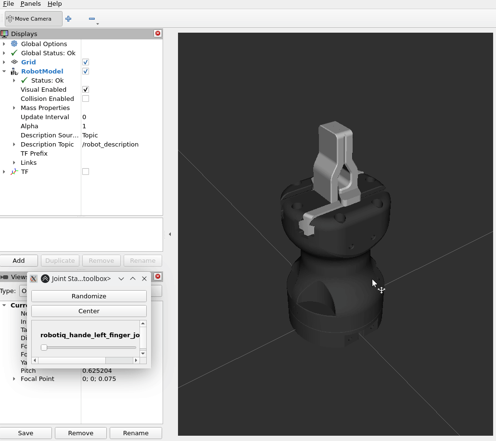

# robotiq_hande_description
### For the driver, check the [robotiq_hande_driver](https://github.com/AGH-CEAI/robotiq_hande_driver/) package from AGH UST.
---

[](https://opensource.org/licenses/Apache-2.0)
[](https://github.com/pre-commit/pre-commit)
[](https://doi.org/10.5281/zenodo.15047934)


This package contains meshes and URDF description of [Robotiq Hand-E gripper](https://robotiq.com/products/hand-e-adaptive-robot-gripper). It was originally developed for integration with Universal Robots e-series (UR5e), however it is be possible to change the coupler model to fit your needs. **PRs are welcome!**


- The gripper comes with coupler model (but without flange).
- This repository comes with CAD models imported from STEP files to FreeCAD format (FCStd).
  - These CAD models are taken from the official [Robotiq Support page](https://robotiq.com/support).
- Package has been developed and tested in ROS 2 Humble.
- The definitions for the `ros2_control` framework are available in the [robotiq_hande_gripper.ros2_control.xacro](./urdf/robotiq_hande_gripper.ros2_control.xacro) file.


> [!IMPORTANT]
> The fingers' joints can be set from **0 to 25 mm** (which corresponds to the maximal grasp with from **0 to 50 mm**).




## Usage

In your URDF (Xacro) file include the Hand-E definition. Provide a unique name and the parent link (for instance `tool0`) as the parameters:

```xml
<xacro:include filename="$(find robotiq_hande_description)/urdf/robotiq_hande_gripper.xacro" />
<!-- ... -->
<xacro:robotiq_hande_gripper name="robotiq_hande_gripper" parent="PARENT_LINK" prefix="" />
```

For estabilishg a connection with [robotiq_hande_driver](https://github.com/AGH-CEAI/robotiq_hande_driver) there is also need to provide more parameters:
```xml
<xacro:robotiq_hande_gripper
    name="robotiq_hande_gripper"
    prefix=""
    parent="tool0"
    grip_pos_min="0.0"
    grip_pos_max="0.025"
    tty="/tmp/ttyUR"
    baudrate="115200"
    parity="N"
    data_bits="8"
    stop_bit="1"
    slave_id="9"
    use_fake_hardware="false"
  />
```

> [!NOTE]
> The TF frame of the end tip of the gripper is called `${prefix}hande_end`, where `${prefix}` evaluates as the `prefix` macro parameter.

### Examples
**An example usage can be find** in the [urdf/hande_preview.urdf.xacro](./urdf/robotiq_hande_gripper.urdf.xacro) file. Furthermore, an integration with whole ROS 2 project example can be find in the [AGH-CEAI/aegis_ros](https://github.com/AGH-CEAI/aegis_ros) repository.


## Preview

1. Build the package with `colcon` and source it:
```bash
colcon build --symlink-install
source ./install/setup.bash
```
1. Run the Rviz with a call to the `urdf_launch` package:
```bash
ros2 launch robotiq_hande_description display.launch.py
```

## Credits
- The original files of the gripper model were taken from the [Robotiq website](https://robotiq.com/products/hand-e-adaptive-robot-gripper).
- The URDF files are based on work of @cambel [repository](https://github.com/cambel/robotiq.git).
- Preview in Rviz is based on [ROS 2 URDF Tutorial](https://github.com/ros/urdf_tutorial/tree/ros2/).
